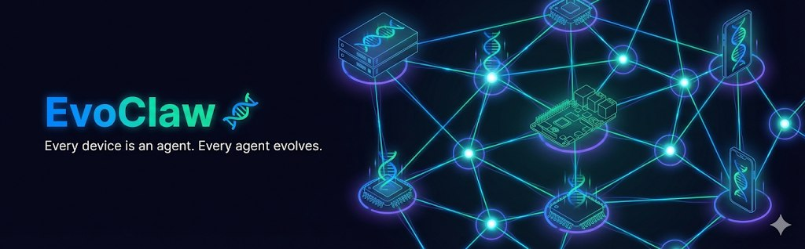

<p align="center">
  
</p>

<p align="center">
  
</p>

<h1 align="center">EvoClaw 🧬</h1>

<p align="center">
  <strong>Self-evolving agent framework for edge devices and IoT.</strong><br>
  Built by agents, for agents. Every device is an agent. Every agent evolves.
</p>

<p align="center">
  <a href="#architecture">Architecture</a> •
  <a href="#building">Building</a> •
  <a href="#status">Status</a>
</p>

## Architecture

```
┌─────────────────────────────────────────┐
│  Go Orchestrator (server/NAS/Pi4+)      │
│  ├── Agent lifecycle management         │
│  ├── Channel routing (WhatsApp/TG/etc)  │
│  ├── LLM API multiplexer               │
│  ├── Self-evolution engine              │
│  └── MQTT broker for agent mesh         │
└──────────┬──────────────────────────────┘
           │ MQTT (lightweight pub/sub)
    ┌──────┴──────┬───────────┬──────────┐
    ▼             ▼           ▼          ▼
┌────────┐  ┌────────┐  ┌────────┐  ┌────────┐
│Rust    │  │Rust    │  │Rust    │  │C       │
│Agent   │  │Agent   │  │Agent   │  │Agent   │
│Trader  │  │Monitor │  │Govern  │  │Sensor  │
│(Pi5)   │  │(NAS)   │  │(VPS)   │  │(ESP32) │
└────────┘  └────────┘  └────────┘  └────────┘
```

## Three-Tier Language Strategy

| Tier | Language | Target | RAM | Use Case |
|------|----------|--------|-----|----------|
| 1 | **Go** | Server, Pi4+ | 64MB+ | Orchestrator, routing, evolution |
| 2 | **Rust** | Pi, phones, NAS | 16MB+ | Edge agents, local inference, WASM skills |
| 3 | **C** | ESP32, MCU | 2KB+ | Sensors, actuators, MQTT telemetry |

## Core Principles

1. **Self-evolving** — Agents track performance metrics and improve their own strategies
2. **Self-tuning** — Auto-select cheapest model that can handle each task
3. **Self-adaptive** — Agents adjust behavior based on environment changes
4. **Container-isolated** — Each agent runs in its own sandbox
5. **Edge-first** — Designed to run on $5 hardware, not just cloud servers
6. **WASM skills** — Write once, deploy to any device

## Project Structure

```
evoclaw/
├── cmd/evoclaw/          # Go orchestrator entrypoint
├── internal/
│   ├── orchestrator/     # Core agent lifecycle
│   ├── channels/         # WhatsApp, Telegram, MQTT
│   ├── agents/           # Agent registry & management
│   ├── evolution/        # Self-improvement engine
│   ├── models/           # LLM provider multiplexer
│   └── config/           # Configuration
├── edge-agent/           # Rust edge agent runtime
├── proto/                # Protocol definitions
└── docs/                 # Architecture docs
```

## Building

```bash
# Orchestrator
go build -o evoclaw ./cmd/evoclaw

# Edge agent
cd edge-agent && cargo build --release
```

## Status

🟡 **Phase 1: Orchestrator MVP** (in progress)
- [ ] Core orchestrator loop
- [ ] Agent registry
- [ ] WhatsApp channel
- [ ] Telegram channel  
- [ ] MQTT agent mesh
- [ ] LLM multiplexer (multi-model)
- [ ] Basic evolution engine

⬜ **Phase 2: Rust Edge Agent**
⬜ **Phase 3: Self-Evolution**
⬜ **Phase 4: ClawChain Integration**

---

*"Every device is an agent. Every agent evolves."*
