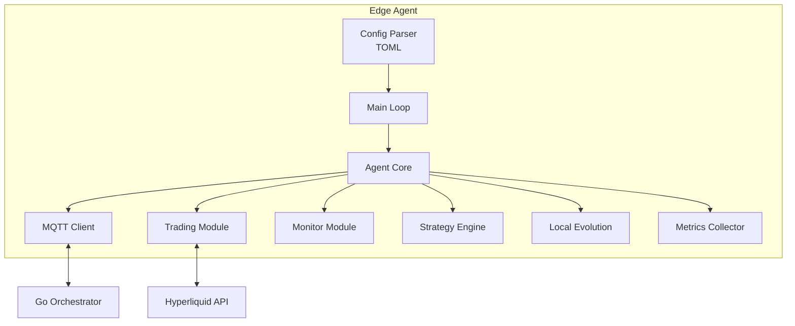

# Rust Edge Agent Deep Dive

The edge agent is a lightweight, self-contained binary written in Rust. It runs on constrained hardware and communicates with the orchestrator via MQTT.

## Overview

- **Binary size**: ~3.2MB (release build with LTO + strip)
- **Language**: Rust 2021 edition
- **Runtime**: Tokio async
- **Communication**: MQTT (rumqttc)
- **Target platforms**: Linux x86_64, ARM64, ARMv7, macOS, Windows

## Build Profile

The release build is optimized for size:

```toml
[profile.release]
opt-level = "s"        # Optimize for size (not speed)
lto = true             # Link-time optimization
codegen-units = 1      # Better optimization, slower compile
strip = true           # Strip debug symbols
panic = "abort"        # Smaller binary (no unwinding)
```

## Architecture



## Module Structure

### `config.rs` — Configuration

Parses TOML configuration:

```rust
#[derive(Debug, Clone, Serialize, Deserialize)]
pub struct Config {
    pub agent_id: String,
    pub agent_type: String,   // "trader", "monitor", "sensor"
    pub mqtt: MqttConfig,
    pub orchestrator: OrchestratorConfig,
    pub trading: Option<TradingConfig>,
    pub monitor: Option<MonitorConfig>,
}

#[derive(Debug, Clone, Serialize, Deserialize)]
pub struct TradingConfig {
    pub hyperliquid_api: String,
    pub wallet_address: String,
    pub private_key_path: String,
    pub max_position_size_usd: f64,
    pub max_leverage: f64,
}
```

### `mqtt.rs` — Communication

MQTT client for orchestrator communication:

```
Topics:
  evoclaw/agents/{id}/commands  ← orchestrator sends commands
  evoclaw/agents/{id}/reports   → agent sends reports
  evoclaw/agents/{id}/status    → agent sends heartbeats
  evoclaw/broadcast             ← orchestrator broadcasts
```

### `trading.rs` — Hyperliquid Client

Full Hyperliquid perpetual futures integration:

- **Market data**: Get all mid prices (`allMids`)
- **Account state**: Positions, margin, P&L (`clearinghouseState`)
- **Order placement**: Limit orders with EIP-712 signing
- **Funding rates**: Real-time funding rate monitoring

```rust
pub struct HyperliquidClient {
    config: TradingConfig,
    client: Client,  // reqwest HTTP client
}

impl HyperliquidClient {
    pub async fn get_all_mids(&self) -> Result<AllMidsResponse>;
    pub async fn get_positions(&self) -> Result<ClearinghouseState>;
    pub async fn place_order(&self, order: OrderRequest) -> Result<OrderResponse>;
}
```

### `strategy.rs` — Trading Strategies

Built-in strategies:

| Strategy | Description | Key Parameters |
|----------|-------------|----------------|
| `FundingArbitrage` | Exploits funding rate discrepancies | `min_rate_threshold`, `position_size` |
| `MeanReversion` | Mean reversion on price deviations | `lookback_period`, `std_dev_threshold` |

```rust
pub trait Strategy: Send + Sync {
    fn name(&self) -> &str;
    fn evaluate(&self, market_data: &MarketData) -> Option<Signal>;
    fn parameters(&self) -> HashMap<String, f64>;
    fn set_parameters(&mut self, params: HashMap<String, f64>);
}
```

### `evolution.rs` — Local Evolution

The edge agent tracks its own fitness locally:

```rust
pub struct LocalEvolution {
    fitness: f64,
    eval_count: u32,
    parameters: HashMap<String, f64>,
    history: Vec<EvolutionSnapshot>,
}
```

Key behaviors:
- Tracks strategy performance metrics
- Computes local fitness score
- Reports fitness to orchestrator via MQTT
- Applies parameter mutations received from orchestrator

### `monitor.rs` — Market Monitoring

Real-time monitoring capabilities:

- Price movement alerts (configurable threshold %)
- Funding rate alerts
- Position P&L monitoring
- Custom metric tracking

### `metrics.rs` — Metrics Collection

Tracks:
- Total trades (win/loss count)
- P&L (realized + unrealized)
- Sharpe ratio
- Max drawdown
- Average hold time
- Strategy-specific custom metrics

## Configuration Example

```toml
agent_id = "hl-trader-1"
agent_type = "trader"

[mqtt]
broker = "localhost"
port = 1883
keep_alive_secs = 30

[orchestrator]
url = "http://localhost:8420"

[trading]
hyperliquid_api = "https://api.hyperliquid.xyz"
wallet_address = "0xYOUR_ADDRESS"
private_key_path = "keys/private.key"
max_position_size_usd = 5000.0
max_leverage = 5.0
```

## Cross-Compilation

```bash
# ARM64 (Raspberry Pi 4, phones)
rustup target add aarch64-unknown-linux-gnu
cargo build --release --target aarch64-unknown-linux-gnu

# ARMv7 (Raspberry Pi Zero, older devices)
rustup target add armv7-unknown-linux-gnueabihf
cargo build --release --target armv7-unknown-linux-gnueabihf

# Check binary size
ls -la target/release/evoclaw-agent
# ~3.2MB
```

## Running

```bash
cd edge-agent

# Development
cargo run -- --config agent.toml

# Production
cargo build --release
./target/release/evoclaw-agent --config agent.toml
```

## See Also

- [Architecture Overview](overview.md)
- [Orchestrator](orchestrator.md)
- [Evolution Engine](evolution.md)
- [MQTT Protocol](../api/mqtt-protocol.md)
- [Trading Agent Guide](../guides/trading-agent.md)
