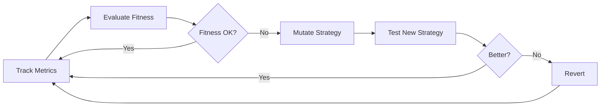

# Evolution Engine

The evolution engine is EvoClaw's core differentiator — agents don't just run, they improve over time.

## Overview

Evolution in EvoClaw is a continuous process:

1. **Observe** — Track agent performance metrics
2. **Evaluate** — Compute a fitness score
3. **Decide** — Is the agent performing well enough?
4. **Mutate** — If not, modify its strategy parameters
5. **Test** — Run the new strategy
6. **Revert** — Roll back if the new strategy is worse



## Strategy

A strategy is the evolvable "genome" of an agent:

```go
type Strategy struct {
    ID             string             // "agent-id-v3"
    AgentID        string             // Owner agent
    Version        int                // Increments on mutation
    SystemPrompt   string             // LLM system prompt
    PreferredModel string             // Primary model
    FallbackModel  string             // Fallback model
    Temperature    float64            // LLM temperature (0.0-2.0)
    MaxTokens      int                // Max response tokens
    Params         map[string]float64 // Custom parameters
    Fitness        float64            // Current fitness score
    EvalCount      int                // Number of evaluations
}
```

### Evolvable Parameters

| Parameter | Range | Description |
|-----------|-------|-------------|
| `Temperature` | 0.0–2.0 | LLM creativity/randomness |
| `MaxTokens` | — | Response length limit |
| `PreferredModel` | — | Model selection preference |
| Custom params | -1000–1000 | Strategy-specific (e.g., trading thresholds) |

## Fitness Function

Fitness is calculated from a weighted combination of metrics:

```go
func computeFitness(metrics map[string]float64) float64 {
    successRate    := metrics["successRate"]          // 0.0-1.0
    costEfficiency := 1.0 / (1.0 + metrics["costUSD"])
    speedScore     := 1.0 / (1.0 + metrics["avgResponseMs"]/1000.0)
    profitScore    := max(0, metrics["profitLoss"]+1.0)

    // Weighted fitness
    fitness := 0.4*successRate +
               0.2*costEfficiency +
               0.1*speedScore +
               0.3*profitScore

    return fitness
}
```

### Weights

| Component | Weight | Rationale |
|-----------|--------|-----------|
| Success Rate | 40% | Primary measure of effectiveness |
| Profit/Loss | 30% | Critical for trading agents |
| Cost Efficiency | 20% | Optimize API spending |
| Speed | 10% | User experience |

### Exponential Moving Average

Fitness uses EMA to smooth out variance:

```go
alpha := 0.3  // Weight of new observation
if s.EvalCount == 0 {
    s.Fitness = fitness
} else {
    s.Fitness = alpha*fitness + (1-alpha)*s.Fitness
}
```

This prevents a single bad evaluation from triggering unnecessary mutation.

## Mutation

When fitness drops below threshold (default: 0.6), the engine mutates:

```go
func mutateFloat(value, rate, min, max float64) float64 {
    delta := value * rate * 0.1  // 10% of value × mutation rate
    // Random direction
    if time.Now().UnixNano()%2 == 0 {
        delta = -delta
    }
    result := value + delta
    // Clamp to bounds
    return clamp(result, min, max)
}
```

### Mutation Process

1. **Archive** current strategy to history
2. **Create** new strategy with incremented version
3. **Mutate** each parameter by `value × mutationRate × 10%`
4. **Reset** fitness and eval count
5. **Deploy** new strategy

### Configuration

```json
{
  "evolution": {
    "enabled": true,
    "evalIntervalSec": 3600,      // Evaluate every hour
    "minSamplesForEval": 10,      // Need 10+ actions first
    "maxMutationRate": 0.2        // Max 20% parameter change
  }
}
```

## Reversion

If a mutated strategy performs worse, the engine can revert:

```go
func (e *Engine) Revert(agentID string) error {
    prev := e.history[agentID][len-1]
    e.strategies[agentID] = prev
    return nil
}
```

The full history is preserved, allowing rollback to any previous version.

## Trading-Specific Evolution

For trading agents, additional metrics feed the fitness function:

```go
type TradeMetrics struct {
    TotalTrades int
    WinRate     float64
    ProfitLoss  float64
    SharpeRatio float64
    MaxDrawdown float64
    AvgHoldTime float64
}
```

Trading-specific parameters that evolve:
- Position sizing thresholds
- Entry/exit timing
- Risk limits
- Strategy weights (when running multiple strategies)

## Persistence

Strategies are persisted to disk:

```
data/evolution/
├── assistant-1.json    # Current strategy
└── eth-trader.json     # Current strategy + history in memory
```

Each file contains the current strategy state:

```json
{
  "id": "eth-trader-v3",
  "agentId": "eth-trader",
  "version": 3,
  "createdAt": "2026-02-06T10:30:00Z",
  "temperature": 0.65,
  "maxTokens": 4096,
  "params": {
    "minFundingRate": 0.0015,
    "positionSizePct": 0.12,
    "stopLossPct": 0.03
  },
  "fitness": 0.72,
  "evalCount": 24
}
```

## Future Improvements

- **Prompt mutation** — Use an LLM to improve system prompts
- **Genetic algorithms** — Tournament selection across multiple strategy variants
- **Multi-objective optimization** — Pareto frontiers for competing metrics
- **Transfer learning** — Share successful strategies between similar agents
- **A/B testing** — Run old vs new strategy simultaneously

## See Also

- [Architecture Overview](overview.md)
- [Orchestrator](orchestrator.md)
- [Genome Format](../reference/genome-format.md)
- [Metrics Reference](../reference/metrics.md)
