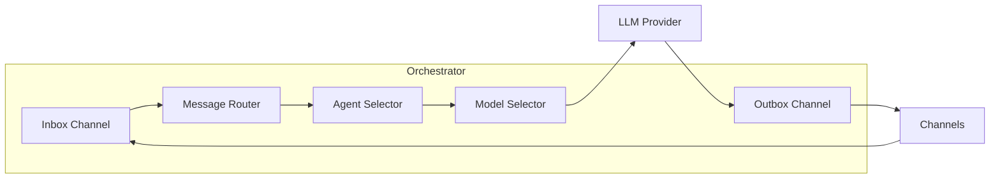

# Go Orchestrator Deep Dive

The orchestrator is the central coordinator of the EvoClaw framework. Written in Go, it manages agents, routes messages, selects models, and drives evolution.

## Overview

- **Binary size**: ~6.9MB (with `-ldflags="-s -w"`)
- **Language**: Go 1.23+
- **Dependencies**: Minimal (MQTT client, WebSocket)
- **Concurrency**: goroutines + channels for message routing

## Core Architecture



## Startup Sequence

1. **Load config** — Parse `evoclaw.json`, create defaults if missing
2. **Create registry** — Load persisted agents from `data/agents/*.json`
3. **Initialize agents** — Create agents defined in config that don't exist yet
4. **Create memory store** — Load conversation history from `data/memory/`
5. **Create model router** — Register all LLM providers and index models
6. **Create evolution engine** — Load strategies from `data/evolution/`
7. **Create orchestrator** — Wire everything together
8. **Register channels** — Start Telegram, MQTT adapters
9. **Start API server** — HTTP + dashboard on configured port
10. **Print banner** — Display startup info

## Message Flow

```go
// Simplified message flow
type Orchestrator struct {
    inbox   chan Message    // Incoming messages from all channels
    outbox  chan Response   // Outgoing responses to channels
}

// receiveFrom pipes channel messages into inbox
func (o *Orchestrator) receiveFrom(ch Channel) {
    for msg := range ch.Receive() {
        o.inbox <- msg
    }
}

// routeIncoming processes messages
func (o *Orchestrator) routeIncoming() {
    for msg := range o.inbox {
        o.handleMessage(msg)
    }
}
```

Messages flow through:
1. **Channel** receives message (Telegram poll, MQTT subscription)
2. **Inbox** buffers the message (capacity: 1000)
3. **Agent selector** picks the right agent
4. **Model selector** picks the right model based on complexity
5. **LLM provider** processes the request
6. **Outbox** queues the response
7. **Channel** delivers the response

## Agent Selection

Currently uses simple routing (first available agent). Future plans include:

- Content-based routing (keywords → specialist agent)
- Load balancing across agents
- Capability matching (skills → agent)
- User affinity (preferred agent per user)

```go
func (o *Orchestrator) selectAgent(msg Message) string {
    // TODO: Smart routing based on message content,
    // agent capabilities, and load balancing
    for id := range o.agents {
        return id
    }
    return ""
}
```

## Model Selection

The model router supports:

- **Complexity-based routing**: Simple → cheap model, Complex → powerful model, Critical → best
- **Fallback chains**: If primary model fails, try alternatives
- **Cost tracking**: Every request's token usage and cost is recorded

```go
// Model selection flow
func (r *Router) Chat(ctx context.Context, modelID string, req ChatRequest, fallback []string) (*ChatResponse, error) {
    // Try primary
    resp, err := r.chatSingle(ctx, modelID, req)
    if err == nil {
        return resp, nil
    }
    // Try fallback chain
    for _, fb := range fallback {
        resp, err = r.chatSingle(ctx, fb, req)
        if err == nil {
            return resp, nil
        }
    }
    return nil, fmt.Errorf("all models failed")
}
```

## State Persistence

All state is stored as JSON files in the data directory:

```
data/
├── agents/           # Agent state snapshots
│   ├── assistant-1.json
│   └── eth-trader.json
├── memory/           # Conversation history
│   └── assistant-1.json
└── evolution/        # Strategy versions
    └── eth-trader.json
```

State is saved:
- On agent status changes
- On memory updates
- On strategy mutations
- On graceful shutdown (all state flushed)

## Graceful Shutdown

```go
func waitForShutdown(app *App) error {
    sigCh := make(chan os.Signal, 1)
    signal.Notify(sigCh, syscall.SIGINT, syscall.SIGTERM)
    <-sigCh

    // Save all state
    app.Registry.SaveAll()
    app.MemoryStore.SaveAll()

    // Stop orchestrator (stops channels)
    app.Orchestrator.Stop()
    return nil
}
```

## HTTP API

The API server provides REST endpoints and the embedded web dashboard:

| Endpoint | Method | Description |
|----------|--------|-------------|
| `/api/status` | GET | System status and uptime |
| `/api/agents` | GET | List all agents |
| `/api/agents/{id}` | GET | Agent details |
| `/api/agents/{id}/metrics` | GET | Agent performance metrics |
| `/api/agents/{id}/memory` | GET | Conversation history |
| `/api/agents/{id}/memory` | DELETE | Clear conversation history |
| `/api/agents/{id}/evolve` | POST | Trigger evolution |
| `/api/agents/{id}/evolution` | GET | Evolution strategy data |
| `/api/models` | GET | List available models |
| `/api/costs` | GET | Cost tracking per model |
| `/api/dashboard` | GET | Aggregated dashboard metrics |
| `/api/logs/stream` | GET | SSE real-time log stream |
| `/` | GET | Web dashboard (embedded) |

## Middleware

- **CORS** — Allow all origins (development-friendly)
- **Logging** — Request method, path, and duration
- **Static files** — Embedded web dashboard served from `/`

## Key Packages

### `internal/orchestrator`

Core coordination logic:
- `Orchestrator` — Main struct, manages channels/providers/agents
- `AgentState` — Runtime state per agent
- `AgentMetrics` — Performance metrics per agent
- `Channel` interface — Abstraction for messaging channels
- `ModelProvider` interface — Abstraction for LLM providers

### `internal/agents`

Agent lifecycle:
- `Registry` — CRUD for agents, health checking, metric updates
- `Agent` — Agent state with thread-safe snapshots
- `Metrics` — Token usage, cost, success rate
- `MemoryStore` — Conversation history with token counting

### `internal/models`

LLM management:
- `Router` — Model selection, fallback chains
- `CostTracker` — Per-model cost tracking
- Provider implementations: Anthropic, OpenAI, Ollama

### `internal/evolution`

Strategy evolution:
- `Engine` — Fitness evaluation, mutation, reversion
- `Strategy` — Evolvable parameters (temperature, model, custom params)

## See Also

- [Architecture Overview](overview.md)
- [Edge Agent](edge-agent.md)
- [Evolution Engine](evolution.md)
- [REST API Reference](../api/rest-api.md)
