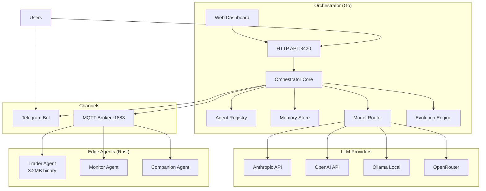
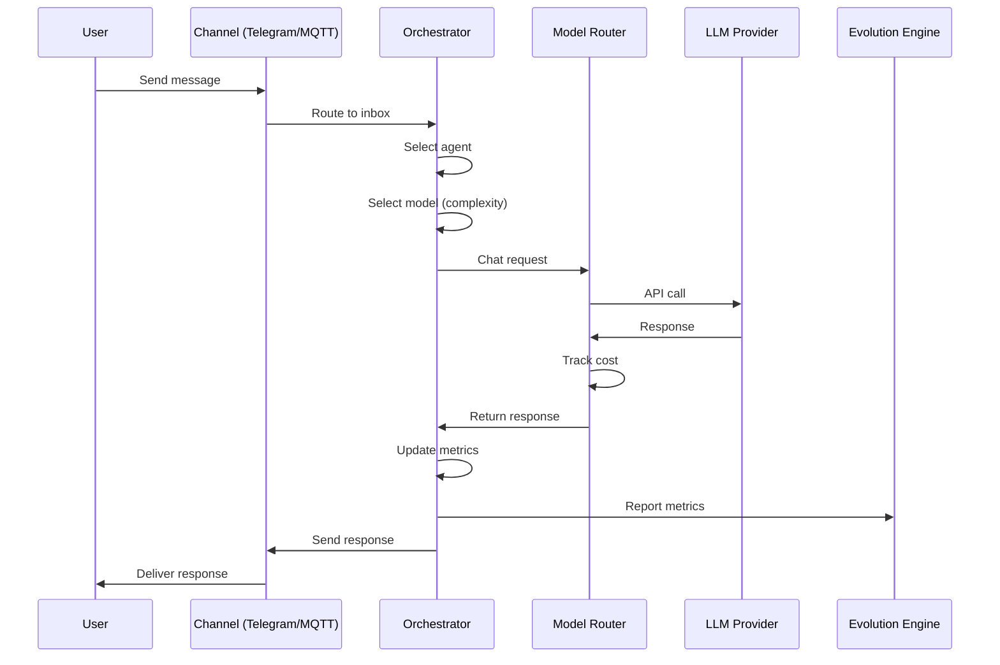
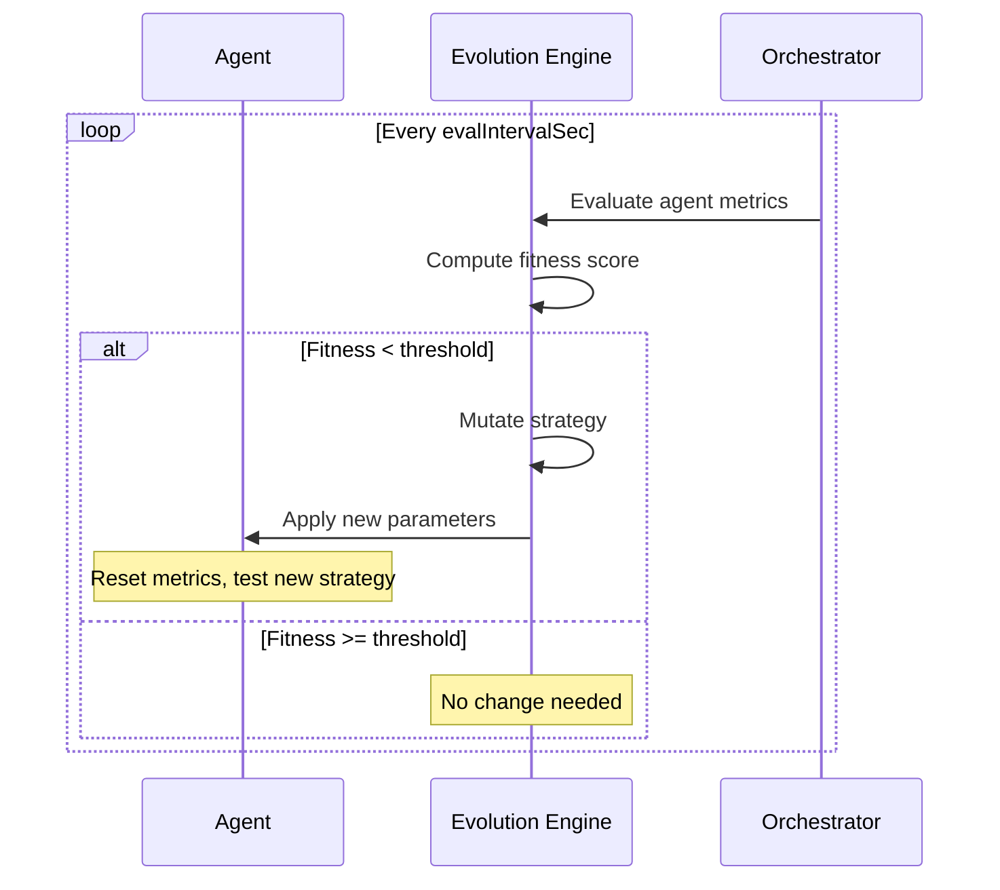

# Architecture Overview

EvoClaw is a two-tier architecture: a **Go orchestrator** that manages everything, and lightweight **Rust edge agents** that run on devices.

## System Architecture



## Component Overview

### Go Orchestrator (~6.9MB binary)

The brain of the operation. Written in Go for simplicity and cross-platform support.

| Component | Package | Purpose |
|-----------|---------|---------|
| **HTTP API** | `internal/api` | REST API + web dashboard + SSE log streaming |
| **Orchestrator** | `internal/orchestrator` | Message routing, agent coordination |
| **Agent Registry** | `internal/agents` | Agent lifecycle, state persistence |
| **Memory Store** | `internal/agents` | Conversation history per agent |
| **Model Router** | `internal/models` | LLM provider management, fallback chains, cost tracking |
| **Evolution Engine** | `internal/evolution` | Fitness evaluation, strategy mutation |
| **Channels** | `internal/channels` | Telegram, MQTT adapters |
| **Config** | `internal/config` | JSON configuration management |

### Rust Edge Agent (~3.2MB binary)

Lightweight agents that run on constrained hardware. Compiled for size with LTO, strip, and panic=abort.

| Component | Module | Purpose |
|-----------|--------|---------|
| **Agent Core** | `agent.rs` | Main agent loop, heartbeat |
| **MQTT Client** | `mqtt.rs` | Communication with orchestrator |
| **Trading** | `trading.rs` | Hyperliquid API client |
| **Strategy** | `strategy.rs` | Trading strategy engine |
| **Evolution** | `evolution.rs` | Local fitness tracking, parameter mutation |
| **Monitor** | `monitor.rs` | Price/funding rate monitoring |
| **Metrics** | `metrics.rs` | Performance metric collection |
| **Config** | `config.rs` | TOML configuration parser |

## Data Flow

### Message Processing



### Evolution Cycle



## Directory Structure

```
evoclaw/
├── cmd/evoclaw/           # Main binary entry point
│   ├── main.go            # Application setup & lifecycle
│   └── web/               # Embedded dashboard assets
├── internal/
│   ├── api/               # HTTP API server + dashboard endpoints
│   ├── agents/            # Agent registry + memory store
│   ├── channels/          # Communication adapters (Telegram, MQTT)
│   ├── config/            # Configuration management
│   ├── evolution/         # Evolution engine
│   ├── models/            # Model router + LLM providers
│   └── orchestrator/      # Core orchestration logic
├── edge-agent/            # Rust edge agent
│   ├── src/               # Source code
│   ├── Cargo.toml         # Dependencies
│   └── agent.example.toml # Example configuration
├── web/                   # Dashboard source (HTML/CSS/JS)
├── docs/                  # Documentation
├── evoclaw.example.json   # Example orchestrator config
└── docker-compose.yml     # Docker stack
```

## Design Principles

1. **Small by default** — Both binaries are tiny. No unnecessary dependencies.
2. **Modular** — Every component is a clean Go package or Rust module.
3. **Stateless orchestrator** — All state is persisted to disk (JSON files). Restart-safe.
4. **Evolution-first** — Metrics tracking and strategy mutation are core, not add-ons.
5. **Multi-model** — Never locked to one LLM provider. Intelligent routing with fallback.

## Deep Dives

- [Orchestrator](orchestrator.md) — Go orchestrator internals
- [Edge Agent](edge-agent.md) — Rust agent architecture
- [Evolution Engine](evolution.md) — How evolution works
- [Communication](communication.md) — MQTT protocol details
