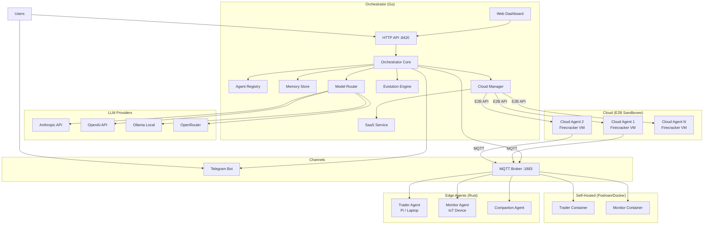
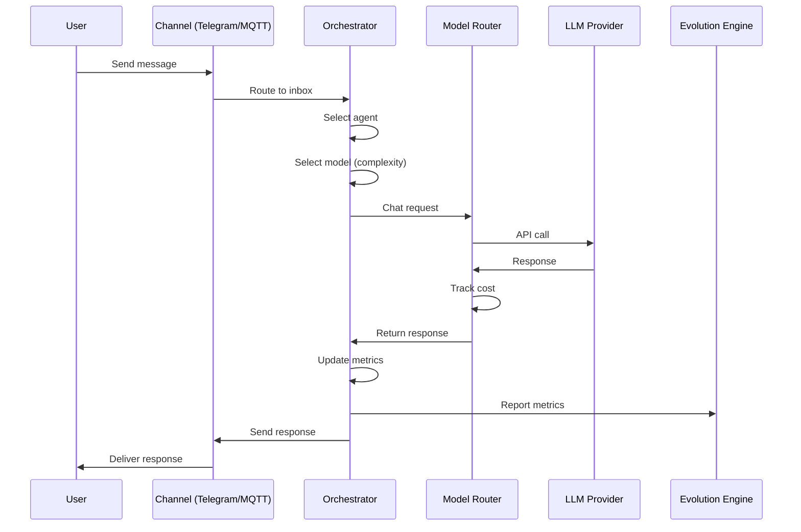
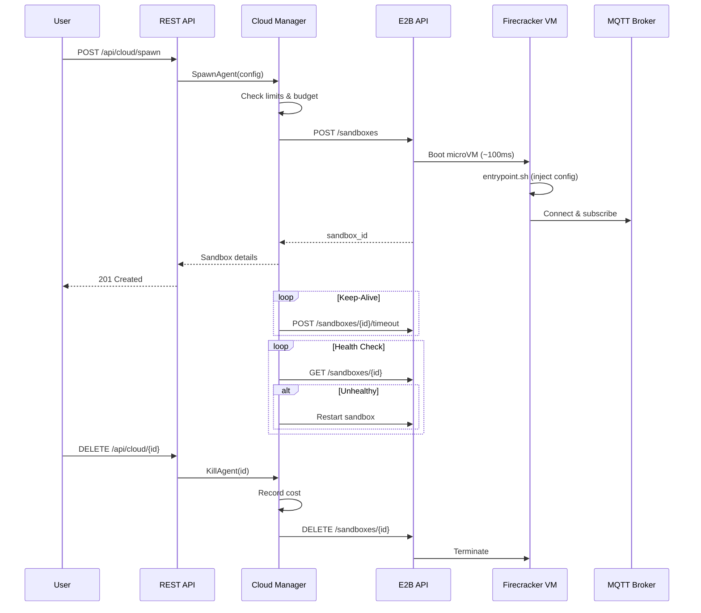
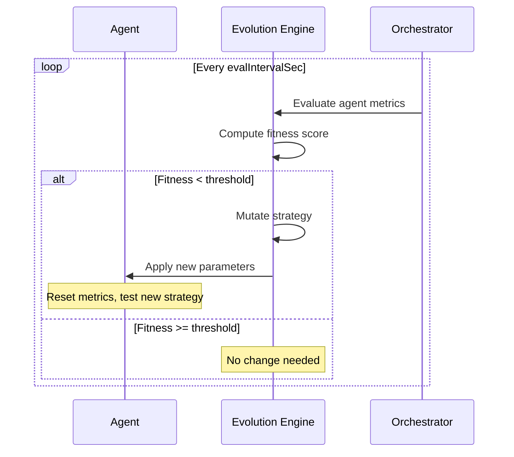

# Architecture Overview

EvoClaw is a **three-tier architecture**: a Go orchestrator that manages everything, lightweight Rust edge agents that run on devices, and E2B cloud sandboxes for instant scaling.

## Three-Tier Deployment Model

```
Edge Devices  →  Raw Rust binary (Pi, IoT, phones)        — 3.2MB, zero deps
Self-Hosted   →  Podman/Docker (your server, your rules)   — Full control
Cloud/SaaS    →  E2B sandboxes (instant scaling, zero ops)  — ~100ms cold start
```

Each tier runs the **same Rust edge agent**. The difference is where and how it's deployed:

| Tier | Target | Isolation | Scaling | Cost |
|------|--------|-----------|---------|------|
| **Edge** | Pi, laptops, phones | Process | Manual | Hardware only |
| **Self-Hosted** | Your servers | Container (Podman/Docker) | Docker Compose | Server costs |
| **Cloud** | E2B Firecracker VMs | MicroVM (Firecracker) | API-driven, instant | ~$0.36/hr/agent |

## System Architecture



## Component Overview

### Go Orchestrator (~6.9MB binary)

The brain of the operation. Written in Go for simplicity and cross-platform support.

| Component | Package | Purpose |
|-----------|---------|---------|
| **HTTP API** | `internal/api` | REST API + web dashboard + SSE log streaming |
| **Orchestrator** | `internal/orchestrator` | Message routing, agent coordination |
| **Agent Registry** | `internal/agents` | Agent lifecycle, state persistence |
| **Memory Store** | `internal/agents` | Conversation history per agent |
| **Model Router** | `internal/models` | LLM provider management, fallback chains, cost tracking |
| **Evolution Engine** | `internal/evolution` | Fitness evaluation, strategy mutation |
| **Cloud Manager** | `internal/cloud` | E2B sandbox lifecycle, health monitoring, cost tracking |
| **SaaS Service** | `internal/saas` | Multi-tenant agent management, user auth, billing |
| **Channels** | `internal/channels` | Telegram, MQTT adapters |
| **Config** | `internal/config` | JSON configuration management |

### Rust Edge Agent (~3.2MB binary)

Lightweight agents that run on constrained hardware. Compiled for size with LTO, strip, and panic=abort.

| Component | Module | Purpose |
|-----------|--------|---------|
| **Agent Core** | `agent.rs` | Main agent loop, heartbeat |
| **MQTT Client** | `mqtt.rs` | Communication with orchestrator |
| **Trading** | `trading.rs` | Hyperliquid API client |
| **Strategy** | `strategy.rs` | Trading strategy engine |
| **Evolution** | `evolution.rs` | Local fitness tracking, parameter mutation |
| **Monitor** | `monitor.rs` | Price/funding rate monitoring |
| **Metrics** | `metrics.rs` | Performance metric collection |
| **Config** | `config.rs` | TOML configuration parser |

### Cloud Manager (`internal/cloud`)

Manages E2B sandboxes as cloud-hosted agent instances.

| Component | File | Purpose |
|-----------|------|---------|
| **E2B Client** | `e2b.go` | REST API client — spawn, kill, list, status, command |
| **Manager** | `manager.go` | Orchestration — scaling, health checks, keep-alive, cost tracking |

### SaaS Service (`internal/saas`)

Multi-tenant agent-as-a-service layer.

| Component | File | Purpose |
|-----------|------|---------|
| **Tenant Store** | `tenant.go` | User registration, API keys, agent tracking, billing |
| **Service** | `service.go` | Business logic — spawn, kill, list per user, burst mode |

## Data Flow

### Message Processing



### Cloud Agent Lifecycle



### Evolution Cycle



## Directory Structure

```
evoclaw/
├── cmd/evoclaw/           # Main binary entry point
│   ├── main.go            # Application setup & lifecycle
│   └── web/               # Embedded dashboard assets
├── internal/
│   ├── api/               # HTTP API server + cloud/SaaS handlers
│   ├── agents/            # Agent registry + memory store
│   ├── channels/          # Communication adapters (Telegram, MQTT)
│   ├── cloud/             # E2B sandbox management + cost tracking
│   ├── config/            # Configuration management
│   ├── evolution/         # Evolution engine
│   ├── models/            # Model router + LLM providers
│   ├── orchestrator/      # Core orchestration logic
│   └── saas/              # Multi-tenant agent-as-a-service
├── edge-agent/            # Rust edge agent
│   ├── src/               # Source code
│   ├── Cargo.toml         # Dependencies
│   └── agent.example.toml # Example configuration
├── deploy/
│   ├── e2b/               # E2B sandbox template (Dockerfile, config)
│   ├── podman-pod.sh      # Podman pod setup
│   └── systemd/           # Bare metal systemd services
├── web/                   # Dashboard source (HTML/CSS/JS)
├── docs/                  # Documentation
├── docker-compose.yml     # Docker stack
├── evoclaw.example.json   # Example orchestrator config
└── Makefile               # Build & deploy commands
```

## API Endpoints

### Core API
| Method | Path | Description |
|--------|------|-------------|
| GET | `/api/status` | System status |
| GET | `/api/agents` | List agents |
| GET | `/api/agents/{id}` | Agent details |
| GET | `/api/models` | Available models |
| GET | `/api/costs` | LLM cost tracking |

### Cloud API (E2B)
| Method | Path | Description |
|--------|------|-------------|
| POST | `/api/cloud/spawn` | Spawn cloud agent |
| GET | `/api/cloud` | List cloud agents |
| GET | `/api/cloud/{id}` | Agent status |
| DELETE | `/api/cloud/{id}` | Kill agent |
| GET | `/api/cloud/costs` | E2B credit usage |

### SaaS API (Multi-tenant)
| Method | Path | Description |
|--------|------|-------------|
| POST | `/api/saas/register` | Register user |
| POST | `/api/saas/agents` | Spawn user agent |
| GET | `/api/saas/agents` | List user agents |
| DELETE | `/api/saas/agents/{id}` | Kill user agent |
| GET | `/api/saas/usage` | User usage report |

## Design Principles

1. **Small by default** — Both binaries are tiny. No unnecessary dependencies.
2. **Modular** — Every component is a clean Go package or Rust module.
3. **Stateless orchestrator** — All state is persisted to disk (JSON files). Restart-safe.
4. **Evolution-first** — Metrics tracking and strategy mutation are core, not add-ons.
5. **Multi-model** — Never locked to one LLM provider. Intelligent routing with fallback.
6. **Three-tier deployment** — Same agent, three deployment targets. Choose your tradeoff.
7. **Tenant isolation** — Cloud sandboxes provide Firecracker-level isolation between users.

## Deep Dives

- [Orchestrator](orchestrator.md) — Go orchestrator internals
- [Edge Agent](edge-agent.md) — Rust agent architecture
- [Evolution Engine](evolution.md) — How evolution works
- [Communication](communication.md) — MQTT protocol details
- [Cloud Deployment](../guides/cloud-deployment.md) — E2B sandbox setup and scaling
