# Deployment Profiles

EvoClaw supports three deployment profiles, from single-machine development to globally distributed fleets. Pick the one that matches your use case and scale up later — the same agent binary works everywhere.

## Overview

| Profile | Machines | Best For | Complexity |
|---------|----------|----------|------------|
| **Solo** | 1 | Development, testing, single-device projects | Minimal |
| **Hub & Spoke** | 2+ | Home lab, IoT mesh, Raspberry Pi clusters | Low |
| **Cloud Fleet** | N | Production SaaS, global agent networks | Moderate |

---

## Profile 1: Solo

Everything on one machine. The fastest way to get started.

### Architecture

```
┌─────────────────────────────────────────┐
│              Your Machine               │
│                                         │
│  ┌──────────────┐  ┌────────────────┐   │
│  │  Orchestrator │  │  MQTT Broker   │   │
│  │  (Go)         │  │  (Mosquitto)   │   │
│  │  :8420        │  │  :1883         │   │
│  └──────┬───────┘  └───────┬────────┘   │
│         │                  │            │
│  ┌──────┴──────────────────┴────────┐   │
│  │        Edge Agent (Rust)         │   │
│  │        monitor / trader          │   │
│  └──────────────────────────────────┘   │
└─────────────────────────────────────────┘
```

### Setup

```bash
# Clone and configure
git clone https://github.com/clawinfra/evoclaw && cd evoclaw
cp evoclaw.example.json evoclaw.json
# Edit evoclaw.json — add your LLM API keys

# Launch everything
make up
```

That's it. The orchestrator, MQTT broker, and a default agent all start together.

### Verify

```bash
curl http://localhost:8420/api/status | jq
open http://localhost:8420  # Web Dashboard
```

### Config

The default `evoclaw.json` works out of the box. Key settings:

```json
{
  "server": { "port": 8420, "dataDir": "./data" },
  "mqtt": { "port": 1883, "host": "0.0.0.0" },
  "agents": [
    {
      "id": "assistant-1",
      "type": "orchestrator",
      "model": "anthropic/claude-sonnet-4-20250514"
    }
  ]
}
```

### When to Use Solo

- Learning EvoClaw
- Local development and testing
- Single-purpose agents (companion, monitor)
- Trying out trading strategies in paper mode

### Scaling Up

When you outgrow Solo, add remote agents with the Hub & Spoke profile. Your existing machine becomes the hub — no reconfiguration needed.

---

## Profile 2: Hub & Spoke

One central hub (your PC or a server) with edge agents on remote devices. This is the **recommended production setup** for home labs and IoT.

### Architecture

```
                    ┌─────────────────────────┐
                    │      Hub (Your PC)      │
                    │                         │
                    │  Orchestrator  :8420    │
                    │  MQTT Broker   :1883    │
                    │  Web Dashboard :8420    │
                    └───────┬─────────────────┘
                            │
              ┌─────────────┼─────────────┐
              │             │             │
    ┌─────────▼───┐  ┌─────▼─────┐  ┌────▼──────┐
    │ Raspberry Pi │  │ NUC/Mini  │  │ Laptop    │
    │ Agent        │  │ Agent     │  │ Agent     │
    │ (monitor)    │  │ (trader)  │  │ (sensor)  │
    └──────────────┘  └───────────┘  └───────────┘
```

### Hub Setup

On your server / main PC:

```bash
# One command to set up the hub
evoclaw setup hub

# Output:
# 🧬 EvoClaw Hub Ready!
#   API:       http://0.0.0.0:8420
#   MQTT:      0.0.0.0:1883
#   Dashboard: http://localhost:8420
#
#   To add an edge agent, run this on your device:
#   ┌──────────────────────────────────────────────┐
#   │  evoclaw-agent join 192.168.99.44            │
#   └──────────────────────────────────────────────┘
```

Then start the orchestrator:

```bash
./evoclaw --config evoclaw.json
```

### Spoke Setup (Edge Agents)

On each remote device (Pi, NUC, laptop):

```bash
# One command — that's it
evoclaw-agent join 192.168.99.44

# Output:
# 🧬 EvoClaw Agent Setup
#   Hub: 192.168.99.44:8420 ✓ (v0.1.0, 1 agent online)
#   MQTT: 192.168.99.44:1883 ✓
#   Agent ID: raspberrypi-a3f2
#   Type: monitor
#   Config: /home/pi/.evoclaw/agent.toml ✓
#
# 🚀 Agent started! Connected to hub.
#   Dashboard: http://192.168.99.44:8420
```

### Customizing Spoke Agents

```bash
# Custom ID and type
evoclaw-agent join 192.168.99.44 --id my-trader --type trader

# Custom ports
evoclaw-agent join 192.168.99.44 --port 9000 --mqtt-port 2883

# Generate config only (don't start)
evoclaw-agent join 192.168.99.44 --no-start
# Then edit ~/.evoclaw/agent.toml and start manually
```

### Networking Requirements

| Port | Protocol | Direction | Purpose |
|------|----------|-----------|---------|
| 8420 | TCP/HTTP | spoke → hub | API + Dashboard |
| 1883 | TCP/MQTT | spoke ↔ hub | Agent communication |

**Firewall rules** (on the hub):

```bash
# UFW
sudo ufw allow 8420/tcp
sudo ufw allow 1883/tcp

# iptables
sudo iptables -A INPUT -p tcp --dport 8420 -j ACCEPT
sudo iptables -A INPUT -p tcp --dport 1883 -j ACCEPT
```

### Systemd Service (Auto-Start on Boot)

On each spoke device, create a systemd service:

```bash
sudo tee /etc/systemd/system/evoclaw-agent.service << 'EOF'
[Unit]
Description=EvoClaw Edge Agent
After=network-online.target
Wants=network-online.target

[Service]
Type=simple
User=pi
ExecStart=/usr/local/bin/evoclaw-agent --config /home/pi/.evoclaw/agent.toml
Restart=always
RestartSec=10

[Install]
WantedBy=multi-user.target
EOF

sudo systemctl daemon-reload
sudo systemctl enable --now evoclaw-agent
```

### Config Files

**Hub** — `evoclaw.json`:

```json
{
  "server": { "port": 8420, "dataDir": "./data" },
  "mqtt": { "host": "0.0.0.0", "port": 1883 },
  "models": {
    "providers": {
      "anthropic": {
        "apiKey": "sk-ant-...",
        "models": [{ "id": "claude-sonnet-4-20250514", "name": "Claude Sonnet" }]
      }
    }
  },
  "evolution": { "enabled": true }
}
```

**Spoke** — `~/.evoclaw/agent.toml` (auto-generated by `join`):

```toml
agent_id = "raspberrypi-a3f2"
agent_type = "monitor"

[mqtt]
broker = "192.168.99.44"
port = 1883

[orchestrator]
url = "http://192.168.99.44:8420"

[monitor]
price_alert_threshold_pct = 5.0
funding_rate_threshold_pct = 0.1
check_interval_secs = 60
```

### When to Use Hub & Spoke

- Home automation / IoT networks
- Raspberry Pi clusters
- Mixed-device trading setups (PC for orchestration, Pi for monitoring)
- Multi-room companion agents
- Any setup where you want centralized control with distributed agents

### Troubleshooting

| Symptom | Likely Cause | Fix |
|---------|-------------|-----|
| `join` hangs | Hub firewall blocking port 8420 | Open port on hub |
| "cannot reach hub" | Wrong IP or hub not running | Verify with `curl http://HUB_IP:8420/api/status` |
| Agent connects but no heartbeats | MQTT port 1883 blocked | Open MQTT port on hub |
| Agent shows "disconnected" in dashboard | Network interruption | Agent auto-reconnects; check logs |
| "agent already exists" | Re-joining with same ID | Normal — agent definition updates |

---

## Profile 3: Cloud Fleet

A VPS or cloud server as the orchestrator with agents deployed anywhere — other VPSes, E2B sandboxes, edge devices, or all of the above.

### Architecture



```mermaid
graph TB
    subgraph Cloud ["Cloud / VPS"]
        Orch[Orchestrator<br>:8420]
        MQTT[MQTT Broker<br>:1883]
        Dashboard[Web Dashboard]
    end

    subgraph E2B ["E2B Sandboxes"]
        VM1[Agent: trader-1<br>Firecracker μVM]
        VM2[Agent: trader-2<br>Firecracker μVM]
        VM3[Agent: monitor-1<br>Firecracker μVM]
    end

    subgraph Edge ["Edge Devices"]
        Pi1[Raspberry Pi<br>sensor-1]
        Pi2[NUC<br>monitor-2]
    end

    Orch --- MQTT
    MQTT --- VM1
    MQTT --- VM2
    MQTT --- VM3
    MQTT --- Pi1
    MQTT --- Pi2
    Dashboard --- Orch
```

### VPS Hub Setup

```bash
# On your VPS
ssh user@your-vps.example.com

# Install and configure
git clone https://github.com/clawinfra/evoclaw && cd evoclaw
evoclaw setup hub --port 8420 --mqtt-port 1883

# Start
./evoclaw --config evoclaw.json
```

### Add E2B Cloud Agents

```bash
# Set E2B API key
export E2B_API_KEY="e2b_..."

# Spawn cloud agents
evoclaw cloud spawn --id trader-1 --type trader
evoclaw cloud spawn --id trader-2 --type trader
evoclaw cloud spawn --id monitor-1 --type monitor

# Check status
evoclaw cloud list
evoclaw cloud costs
```

### Add Edge Agents

```bash
# On any device with internet access to the VPS
evoclaw-agent join your-vps.example.com
```

### Security Considerations

For cloud deployments:

1. **TLS for MQTT** — Use a reverse proxy (nginx/Caddy) with TLS termination
2. **Firewall** — Only expose ports 8420 and 1883 to trusted IPs
3. **API authentication** — Use the SaaS API with API keys for multi-tenant access
4. **VPN** — Consider WireGuard for private agent mesh networking

### Networking

| Port | Purpose | Access |
|------|---------|--------|
| 8420 | API + Dashboard | Restricted to admins |
| 1883 | MQTT | Agent connections only |
| 443 | TLS-terminated MQTT (optional) | Via reverse proxy |

### Nginx Reverse Proxy Example

```nginx
server {
    listen 443 ssl;
    server_name evoclaw.example.com;

    ssl_certificate /etc/letsencrypt/live/evoclaw.example.com/fullchain.pem;
    ssl_certificate_key /etc/letsencrypt/live/evoclaw.example.com/privkey.pem;

    location / {
        proxy_pass http://127.0.0.1:8420;
        proxy_set_header Host $host;
        proxy_set_header X-Forwarded-For $proxy_add_x_forwarded_for;
    }

    # SSE log streaming
    location /api/logs/stream {
        proxy_pass http://127.0.0.1:8420;
        proxy_http_version 1.1;
        proxy_set_header Connection "";
        proxy_buffering off;
    }
}
```

### Cost Management

E2B sandbox costs:

| Resource | Cost | Notes |
|----------|------|-------|
| Sandbox uptime | ~$0.36/hr | Per active sandbox |
| Budget cap | Configurable | Set in `evoclaw.json` → `cloud.creditBudgetUsd` |

Monitor with:

```bash
evoclaw cloud costs
```

### When to Use Cloud Fleet

- Production SaaS deployments
- Global agent networks spanning multiple regions
- High-availability setups with cloud + edge redundancy
- Multi-tenant agent hosting
- Scaling beyond what a single server can handle

---

## Migrating Between Profiles

### Solo → Hub & Spoke

Your Solo machine becomes the hub. No config changes needed.

1. Open ports 8420 and 1883 on your firewall
2. Run `evoclaw-agent join YOUR_IP` on each new device
3. Done — your existing agents keep running

### Hub & Spoke → Cloud Fleet

1. Move the orchestrator to a VPS
2. Update your existing spoke agents' `agent.toml` to point to the VPS
3. Add E2B cloud agents as needed
4. Edge agents keep working alongside cloud agents

### Any Profile → Any Profile

The `join` command works regardless of where the hub runs. Point it at any reachable EvoClaw orchestrator and the agent self-configures.

---

## Quick Reference

```bash
# Solo — everything local
make up

# Hub — set up this machine as orchestrator
evoclaw setup hub

# Spoke — join a remote hub
evoclaw-agent join <HUB_IP>

# Cloud — spawn E2B sandbox agents
evoclaw cloud spawn --type trader

# Status check
curl http://localhost:8420/api/status
```
