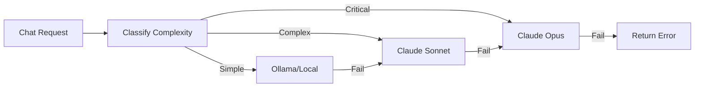

# Configure Model Providers & Routing

EvoClaw's model router intelligently selects LLM providers based on task complexity, with automatic fallback chains.

## Overview



## Provider Configuration

### Anthropic (Claude)

```json
{
  "models": {
    "providers": {
      "anthropic": {
        "apiKey": "sk-ant-api03-YOUR_KEY",
        "models": [
          {
            "id": "claude-sonnet-4-20250514",
            "name": "Claude Sonnet 4",
            "contextWindow": 200000,
            "costInput": 3.0,
            "costOutput": 15.0,
            "capabilities": ["reasoning", "code", "vision"]
          },
          {
            "id": "claude-haiku-3-20250722",
            "name": "Claude Haiku 3",
            "contextWindow": 200000,
            "costInput": 0.25,
            "costOutput": 1.25,
            "capabilities": ["reasoning", "code"]
          }
        ]
      }
    }
  }
}
```

### OpenAI

```json
{
  "openai": {
    "apiKey": "sk-YOUR_KEY",
    "models": [
      {
        "id": "gpt-4o",
        "name": "GPT-4o",
        "contextWindow": 128000,
        "costInput": 2.5,
        "costOutput": 10.0,
        "capabilities": ["reasoning", "code", "vision"]
      },
      {
        "id": "gpt-4o-mini",
        "name": "GPT-4o Mini",
        "contextWindow": 128000,
        "costInput": 0.15,
        "costOutput": 0.6,
        "capabilities": ["reasoning", "code"]
      }
    ]
  }
}
```

### Ollama (Local)

```json
{
  "ollama": {
    "baseUrl": "http://localhost:11434",
    "models": [
      {
        "id": "llama3.2:3b",
        "name": "Llama 3.2 3B",
        "contextWindow": 128000,
        "costInput": 0.0,
        "costOutput": 0.0,
        "capabilities": ["reasoning"]
      },
      {
        "id": "qwen2.5-coder:7b",
        "name": "Qwen 2.5 Coder 7B",
        "contextWindow": 32768,
        "costInput": 0.0,
        "costOutput": 0.0,
        "capabilities": ["code"]
      }
    ]
  }
}
```

### OpenRouter

```json
{
  "openrouter": {
    "baseUrl": "https://openrouter.ai/api/v1",
    "apiKey": "sk-or-YOUR_KEY",
    "models": [
      {
        "id": "anthropic/claude-sonnet-4",
        "name": "Claude Sonnet 4 (via OpenRouter)",
        "contextWindow": 200000,
        "costInput": 3.0,
        "costOutput": 15.0,
        "capabilities": ["reasoning", "code"]
      }
    ]
  }
}
```

### Custom OpenAI-Compatible Provider

Any provider with an OpenAI-compatible API works:

```json
{
  "my-provider": {
    "baseUrl": "https://my-llm-api.example.com/v1",
    "apiKey": "my-api-key",
    "models": [
      {
        "id": "my-model",
        "name": "My Custom Model",
        "contextWindow": 32768,
        "costInput": 1.0,
        "costOutput": 2.0,
        "capabilities": ["reasoning"]
      }
    ]
  }
}
```

## Routing Rules

Configure which model handles which task complexity:

```json
{
  "models": {
    "routing": {
      "simple": "ollama/llama3.2:3b",
      "complex": "anthropic/claude-sonnet-4-20250514",
      "critical": "anthropic/claude-sonnet-4-20250514"
    }
  }
}
```

### Complexity Levels

| Level | Use Case | Recommended |
|-------|----------|-------------|
| `simple` | Casual chat, simple questions | Local model (free) |
| `complex` | Code generation, analysis, reasoning | Mid-tier cloud model |
| `critical` | Trading decisions, financial, safety-critical | Best available model |

### Cost Optimization Strategy

**Budget-conscious setup:**
```json
{
  "simple": "ollama/llama3.2:3b",
  "complex": "openai/gpt-4o-mini",
  "critical": "anthropic/claude-sonnet-4-20250514"
}
```

**Performance-first setup:**
```json
{
  "simple": "anthropic/claude-haiku-3-20250722",
  "complex": "anthropic/claude-sonnet-4-20250514",
  "critical": "anthropic/claude-sonnet-4-20250514"
}
```

**All-local setup:**
```json
{
  "simple": "ollama/llama3.2:3b",
  "complex": "ollama/llama3.1:70b",
  "critical": "ollama/llama3.1:70b"
}
```

## Fallback Chains

The router automatically tries fallback models when the primary fails:

```go
// Internally, the router does:
resp, err := router.Chat(ctx, primaryModel, request, []string{
    "anthropic/claude-sonnet-4-20250514",  // Fallback 1
    "openai/gpt-4o",                       // Fallback 2
    "ollama/llama3.2:3b",                  // Fallback 3 (local)
})
```

Fallback is automatic — if Anthropic is down, it tries OpenAI, then local.

## Cost Tracking

Every request is tracked:

```bash
curl http://localhost:8420/api/costs | jq
```

```json
{
  "anthropic/claude-sonnet-4-20250514": {
    "TotalRequests": 156,
    "TotalTokensIn": 234567,
    "TotalTokensOut": 89012,
    "TotalCostUSD": 2.34
  },
  "ollama/llama3.2:3b": {
    "TotalRequests": 892,
    "TotalTokensIn": 456789,
    "TotalTokensOut": 123456,
    "TotalCostUSD": 0.0
  }
}
```

Monitor costs in the [Models dashboard view](http://localhost:8420/#models).

## Per-Agent Model Override

Each agent can specify its preferred model:

```json
{
  "agents": [
    {
      "id": "trader",
      "model": "anthropic/claude-sonnet-4-20250514"
    },
    {
      "id": "chatbot",
      "model": "ollama/llama3.2:3b"
    }
  ]
}
```

If the agent's model isn't available, the routing config is used as fallback.

## See Also

- [Configuration](../getting-started/configuration.md)
- [Orchestrator Architecture](../architecture/orchestrator.md)
- [REST API](../api/rest-api.md)
