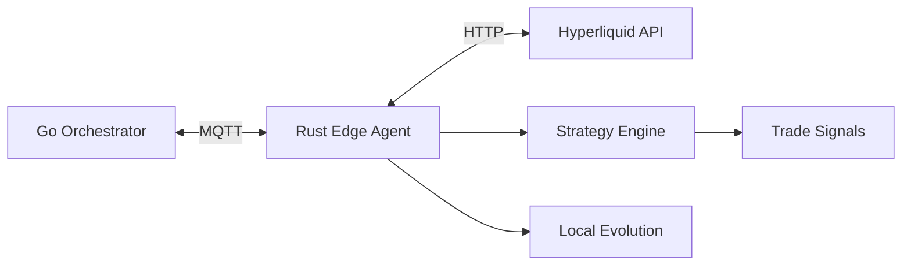

# Set Up a Trading Agent

This guide walks you through deploying an EvoClaw trading agent connected to Hyperliquid perpetual futures.

> ⚠️ **Risk Warning**: Trading involves significant financial risk. Start with small position sizes and test thoroughly. EvoClaw provides the framework — you manage the risk.

## Overview

The trading agent architecture:



## Prerequisites

- Running EvoClaw orchestrator
- MQTT broker (Mosquitto)
- Hyperliquid account with API access
- Rust toolchain (to build edge agent)

## Step 1: Configure the Orchestrator

Add a trader agent definition to `evoclaw.json`:

```json
{
  "agents": [
    {
      "id": "hl-trader-1",
      "name": "ETH Funding Trader",
      "type": "trader",
      "model": "anthropic/claude-sonnet-4-20250514",
      "systemPrompt": "You are a cautious crypto trader specializing in ETH perpetual futures on Hyperliquid. Focus on funding rate arbitrage and mean reversion strategies.",
      "skills": ["trading"],
      "config": {
        "exchange": "hyperliquid",
        "max_position_usd": "5000",
        "max_leverage": "5"
      }
    }
  ]
}
```

## Step 2: Configure the Edge Agent

```bash
cd edge-agent
cp agent.example.toml agent.toml
```

Edit `agent.toml`:

```toml
agent_id = "hl-trader-1"
agent_type = "trader"

[mqtt]
broker = "localhost"
port = 1883
keep_alive_secs = 30

[orchestrator]
url = "http://localhost:8420"

[trading]
hyperliquid_api = "https://api.hyperliquid.xyz"
wallet_address = "0xYOUR_WALLET_ADDRESS"
private_key_path = "keys/private.key"
max_position_size_usd = 5000.0
max_leverage = 5.0
```

### Generate Keys

```bash
# Create keys directory
mkdir -p keys

# Generate a Hyperliquid-compatible private key
# NEVER commit this file to git
python3 scripts/hl_sign.py --generate
```

## Step 3: Build and Run the Edge Agent

```bash
cd edge-agent
cargo build --release

# Run
./target/release/evoclaw-agent --config agent.toml
```

The agent will:
1. Connect to the MQTT broker
2. Register with the orchestrator
3. Start monitoring markets
4. Execute strategies based on signals

## Step 4: Monitor

### Dashboard

Open [http://localhost:8420](http://localhost:8420) and navigate to:
- **Trading** view — Positions, P&L, strategies
- **Agents** → click your trader — Detailed metrics
- **Evolution** — Strategy fitness and mutations

### API

```bash
# Agent status
curl http://localhost:8420/api/agents/hl-trader-1 | jq

# Metrics
curl http://localhost:8420/api/agents/hl-trader-1/metrics | jq

# Evolution data
curl http://localhost:8420/api/agents/hl-trader-1/evolution | jq
```

## Built-in Strategies

### Funding Arbitrage

Exploits funding rate discrepancies on Hyperliquid perpetual futures:

- When funding rate is significantly positive → short (earn funding)
- When funding rate is significantly negative → long (earn funding)
- Exit when funding rate normalizes

Key parameters:
- `min_rate_threshold`: Minimum funding rate to trigger entry (default: 0.01%)
- `position_size`: Fraction of max position to use
- `exit_threshold`: Rate at which to exit

### Mean Reversion

Trades on the assumption that prices revert to their mean:

- Track rolling average price
- Enter when price deviates by X standard deviations
- Exit when price returns to mean

Key parameters:
- `lookback_period`: Number of samples for rolling average
- `std_dev_threshold`: Standard deviations for entry signal
- `max_hold_time`: Maximum time to hold a position

## Risk Management

The edge agent enforces hard limits:

| Limit | Config Key | Description |
|-------|-----------|-------------|
| Max position size | `max_position_size_usd` | Maximum USD value per position |
| Max leverage | `max_leverage` | Maximum leverage multiplier |
| Stop loss | Strategy-defined | Automatic exit on loss threshold |

These limits are **hard boundaries** that the evolution engine cannot exceed.

## Evolution

The trading agent evolves its strategy parameters over time:

1. Tracks win rate, P&L, Sharpe ratio, max drawdown
2. Fitness score computed from weighted metrics
3. If fitness drops below threshold, parameters mutate:
   - Entry/exit thresholds adjust
   - Position sizing changes
   - Timing parameters shift
4. New strategy is tested
5. Reverted if worse than previous

## Deploying to Raspberry Pi

```bash
# Cross-compile for ARM64
rustup target add aarch64-unknown-linux-gnu
cargo build --release --target aarch64-unknown-linux-gnu

# Copy to Pi
scp target/aarch64-unknown-linux-gnu/release/evoclaw-agent pi@raspberrypi:~/
scp agent.toml pi@raspberrypi:~/

# Run on Pi
ssh pi@raspberrypi
./evoclaw-agent --config agent.toml
```

## See Also

- [Custom Strategy Guide](custom-strategy.md)
- [Edge Agent Architecture](../architecture/edge-agent.md)
- [Evolution Engine](../architecture/evolution.md)
- [Genome Format](../reference/genome-format.md)
